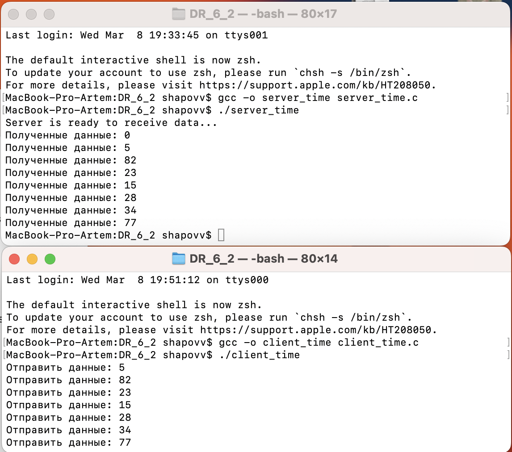

# ДР_6
## Шаповалов Артём | БПИ-217

**Задание**

Разработать программы клиента и сервера, взаимодействующих через разделяемую память с использованием функций UNIX SYSTEM V. Клиент генерирует случайные числа в том же диапазоне, что и ранее рассмотренный пример.
Сервер осуществляет их вывод. Необходимо обеспечить корректное завершение работы для одного клиента и сервера, при котором удаляется сегмент разделяемой памяти.
Предложить и реализовать свой вариант корректного завершения. Описать этот вариант в отчете.

Опционально. Реализовать и описать дополнительно один или два варианта завершения (+1 за каждый вариант).

**Решение**

Реализованы шесть программ:
[client_one.c](client_one.c) и [server_one.c](server_one.c) - останавливающиеся по сочетаню Control+C;

[client_exit.c](client_exit.c) и [server_exit.c](server_exit.c) - останавливающиеся при вводе "exit" в терминал;

[client_time.c](client_time.c) и [server_time.c](server_time.c) - останавливающиеся по истечении 8 секунд;

Комментарии содержатся в соответствующих файлах программ.

**Компиляция и запуск исполняемых файлов:**

Сначала важно скомпилировать и запустить программы клиента, а затем сервера.

В первом окне терминала:
```{c}
gcc -o client_one client_one.c

./client_one
```
Во втором окне терминала:
```{c}
gcc -o rserver_one server_one.c

./server_one
```

Для других программ аналогично.

**Пример работы программ:**

Для [client_one.c](client_one.c) и [server_one.c](server_one.c):


Для [client_exit.c](client_exit.c) и [server_exit.c](server_exit.c):


Для [client_time.c](client_time.c) и [server_time.c](server_time.c):


